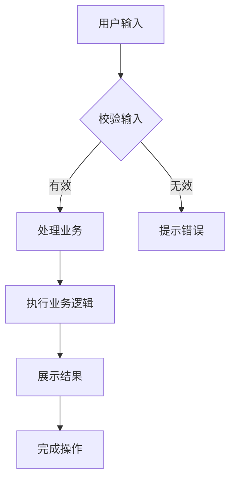
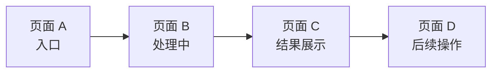
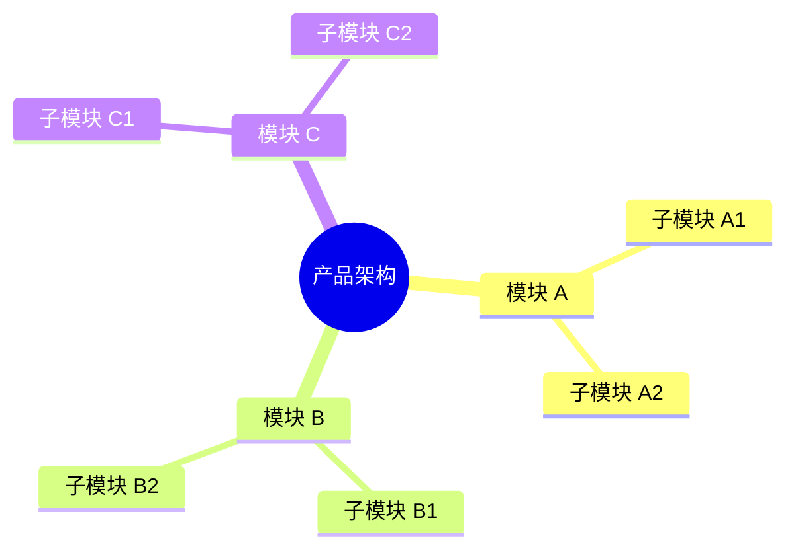

# PRD 产品需求文档编写模版

### 版本信息

| 版本 | 状态 | 作者 | 日期 | 核心变更 |
|------|------|------|------|----------|
| v1.0 | 草稿 | - | YYYY-MM-DD | 初始版本 |

### 基本信息

- **文档版本**: v1.0
- **当前阶段**: [ ] 需求评审  [ ] UI设计  [ ] 开发中  [ ] 已上线
- **创建人**: 
- **创建日期**: 
- **最后更新**: 
- **核心干系人**: 产品 · 设计 · 开发 · 测试 · 业务

### 关联文档

| 文档类型 | 文档名称 | 链接/位置 |
|----------|----------|-----------|
| 市场调研报告 | - | - |
| 竞品分析 | - | - |
| 用户调研/访谈记录 | - | - |
| 项目提案 | - | - |
| 交互原型 | - | - |
| UI 设计稿 | - | - |
| 数据埋点需求 | - | - |
| 技术设计文档 | - | - |

### 术语表

| 术语 | 全称 | 定义 |
|------|------|------|
| UGC | User Generated Content | 用户生成内容 |
| - | - | - |

---

## 一、需求背景与目标

### 1.1 项目概述

> 一句话描述产品/功能的核心价值

**示例**: 一款帮助用户 [核心价值描述] 的产品/工具

---

### 1.2 核心问题

#### 1.2.1 目标用户画像

| 维度 | 描述 |
|------|------|
| 用户角色 | [角色描述] |
| 使用场景 | [场景描述] |
| 核心诉求 | [核心诉求描述] |

#### 1.2.2 用户场景

| # | 场景 | 描述 |
|---|------|------|
| 1 | 场景一 | [具体场景描述] |
| 2 | 场景二 | [具体场景描述] |
| 3 | 场景三 | [具体场景描述] |

#### 1.2.3 用户痛点

> 用户当前面临的具体问题（3-4 条）

| # | 痛点 | 描述 | 频率 |
|---|------|------|------|
| 1 | 痛点一 | [具体痛点描述] | [频率] |
| 2 | 痛点二 | [具体痛点描述] | [频率] |
| 3 | 痛点三 | [具体痛点描述] | [频率] |
| 4 | 痛点四 | [具体痛点描述] | [频率] |

---

### 1.3 用户故事

> 使用标准格式：`作为 [角色]，我希望 [任务]，以便 [价值]`

| # | 用户故事 | 验收标准 |
|---|----------|----------|
| 1 | 作为 [角色]，我希望 [任务]，以便 [价值] | [可衡量的验收条件] |
| 2 | 作为 [角色]，我希望 [任务]，以便 [价值] | [可衡量的验收条件] |
| 3 | 作为 [角色]，我希望 [任务]，以便 [价值] | [可衡量的验收条件] |

---

### 1.4 项目目标与价值

#### 1.4.1 用户价值

- 价值点 1：[用户价值描述]
- 价值点 2：[用户价值描述]
- 价值点 3：[用户价值描述]

#### 1.4.2 业务价值

- 业务价值 1：[业务价值描述]
- 业务价值 2：[业务价值描述]

#### 1.4.3 SMART 目标

| 目标维度 | 具体描述 |
|----------|----------|
| Specific（具体） | [具体目标描述] |
| Measurable（可衡量） | [可量化指标] |
| Achievable（可实现） | [实现路径] |
| Relevant（相关性） | [与产品定位关系] |
| Time-bound（有时限） | [完成时间节点] |

---

### 1.5 范围定义

#### 1.5.1 本次迭代范围（In-Scope）

- [ ] 功能 A：[功能描述]
- [ ] 功能 B：[功能描述]
- [ ] 功能 C：[功能描述]
- [ ] 功能 D：[功能描述]

#### 1.5.2 暂不在范围内（Out-of-Scope）

- 暂不支持：[功能描述]
- 暂不支持：[功能描述]
- 暂不支持：[功能描述]

---

### 1.6 需求列表

| 需求 ID | 模块 | 描述 | 优先级 | 状态 | 备注 |
|---------|------|------|--------|------|------|
| REQ-001 | [模块名] | [需求描述] | P0 | 待开发 | 核心功能 |
| REQ-002 | [模块名] | [需求描述] | P1 | 待开发 | - |
| REQ-003 | [模块名] | [需求描述] | P2 | 待开发 | 可后续迭代 |

---

## 二、方案概述

### 2.1 业务流程图



### 2.2 核心功能流程



### 2.3 信息架构（IA）



---

## 三、细节方案

### 3.1 功能模块：[模块名称]

#### 3.1.1 页面原型与交互描述

| 状态 | 描述 | 界面示意 |
|------|------|----------|
| **初始状态** | 页面加载完成，等待用户操作 | [配图] |
| **触发动作** | 用户完成关键操作 | [配图] |
| **成功状态** | 操作成功，展示结果 | [配图] |
| **失败状态** | 操作失败，提示错误 | [配图] |
| **空状态** | 无数据时展示 | [配图] |

##### 交互逻辑

```markdown
1. 用户完成输入/选择
2. 系统校验输入
   - 有效 → 进入处理流程
   - 无效 → 提示错误信息
3. 执行业务逻辑
4. 展示处理结果
```

##### 数据需求

| 参数 | 类型 | 说明 |
|------|------|------|
| param_a | string | 参数 A 描述 |
| param_b | string | 参数 B 描述 |
| param_c | number | 参数 C 描述（可选） |

#### 3.1.2 边界情况处理

| 场景 | 处理方式 |
|------|----------|
| 快速连续点击 | 防抖处理，限制触发频率 |
| 输入解析失败 | 提示错误信息，保留重试选项 |
| 服务响应超时 | 提示超时，保留重试按钮 |
| 数据量过大 | 截断或分页处理 |
| 非法输入 | 提示「请输入有效内容」 |

#### 3.1.3 非功能性需求

| 类型 | 需求描述 |
|------|----------|
| 性能需求 | [量化指标，如：响应时间 ≤ X 秒] |
| 兼容性 | [支持的浏览器/系统范围] |
| 数据埋点 | 见下方埋点表 |

##### 数据埋点需求

| 事件名称 | 触发时机 | 页面/位置 | 参数 | 备注 |
|----------|----------|-----------|------|------|
| event_a | 用户触发操作 A | 页面/位置 | param_a, param_b | 核心事件 |
| event_b | 操作 B 成功 | 结果页 | duration | - |
| event_c | 操作 B 失败 | 结果页 | error_type | 需分类 |
| event_d | 用户点击分享 | 结果页 | item_id | - |

---

## 四、附录（可选）

### 4.1 会议纪要

| 日期 | 主题 | 参与人 | 纪要链接 |
|------|------|--------|----------|
| YYYY-MM-DD | 需求评审会 | 产品、开发、设计 | [链接] |

### 4.2 原始用户反馈

> 收集的用户访谈、原型测试反馈等

### 4.3 Q&A

| # | 问题 | 回答 | 状态 |
|---|------|------|------|
| 1 | ... | ... | 已解答 |

---

## 编写规范

### 图表绘制

- 流程图、业务图、架构图等**统一使用 Mermaid** 绘制
- 示例：` ```mermaid flowchart TD ... ``` `

### 章节使用

- **编写规范章节**：仅作为模版说明使用，**实际 PRD 文档中删除此章节**
- **附录章节**：可选内容板块，**如无实际内容（会议纪要、Q&A 等）则删除整个附录章节**
- **原型修改**：当修改交互原型时，**询问是否同步更新 PRD**，保持文档与原型的一致性
- **需求变更**：当添加新需求或修改功能时，**询问是否同步更新 PRD**，保持文档与实现的一致性

### 分阶段编写

| 阶段 | 完成章节 | 文档状态 |
|------|----------|----------|
| 需求初稿 | 一 | 明确「做什么」，聚焦问题与价值 |
| 方案评审稿 | 一、二 | 确定「怎么做」，完成方案设计 |
| 开发交付稿 | 一、二、三、四（如有） | 细化「做成什么样」，交付可执行细节 |
