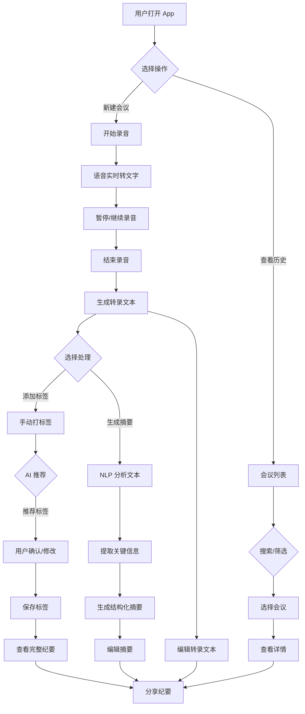
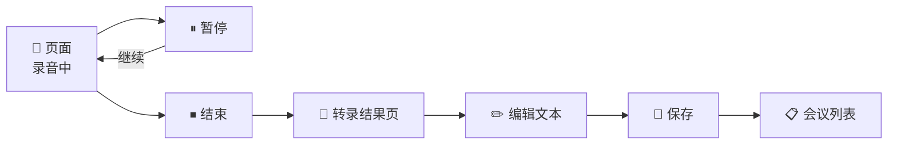
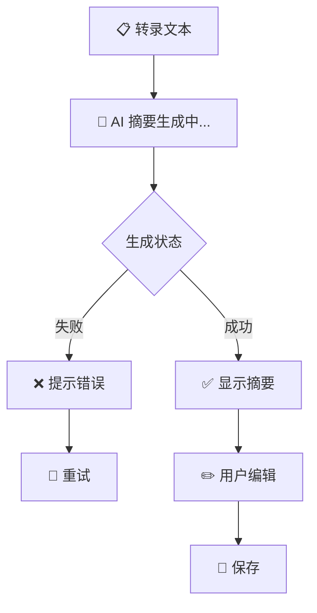
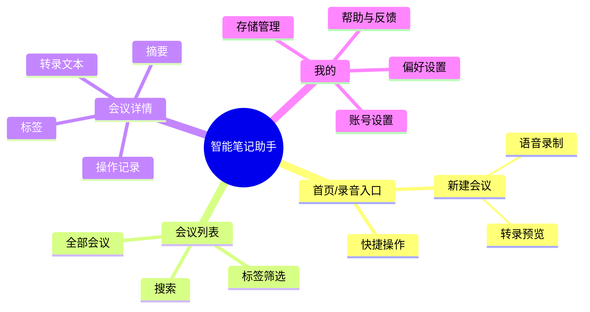
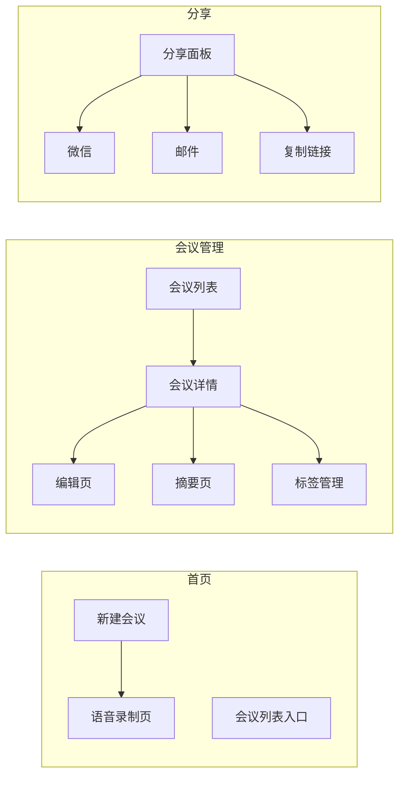

# PRD 产品需求文档：智能笔记助手

### 版本信息

| 版本 | 状态 | 作者 | 日期 | 核心变更 |
|------|------|------|------|----------|
| v1.0 | 草稿 | 产品团队 | 2026-04-09 | 初始版本 |

### 基本信息

- **文档版本**: v1.0
- **当前阶段**: [x] 需求评审  [ ] UI设计  [ ] 开发中  [ ] 已上线
- **创建人**: 产品团队
- **创建日期**: 2026-04-09
- **最后更新**: 2026-04-09
- **核心干系人**: 产品 · 设计 · 开发 · 测试 · 业务

### 关联文档

| 文档类型 | 文档名称 | 链接/位置 |
|----------|----------|-----------|
| 市场调研报告 | - | [TBD] |
| 竞品分析 | - | [TBD] |
| 用户调研/访谈记录 | - | [TBD] |
| 项目提案 | - | [TBD] |
| 交互原型 | - | [TBD] |
| UI 设计稿 | - | [TBD] |
| 数据埋点需求 | - | [TBD] |
| 技术设计文档 | - | [TBD] |

### 术语表

| 术语 | 全称 | 定义 |
|------|------|------|
| ASR | Automatic Speech Recognition | 自动语音识别，即将语音转换为文字的技术 |
| NLP | Natural Language Processing | 自然语言处理，用于文本分析和理解 |
| 会议纪要 | Meeting Minutes | 会议内容的结构化记录，包含要点、决策和行动项 |

---

## 一、需求背景与目标

### 1.1 项目概述

> 一句话描述产品/功能的核心价值

**智能笔记助手** 是一款帮助职场人士高效整理会议纪要的移动端应用，通过 AI 驱动的语音转文字、自动摘要和智能标签分类功能，让用户从繁琐的会议记录工作中解脱出来，专注于更有价值的思考和决策。

---

### 1.2 核心问题

#### 1.2.1 目标用户画像

| 维度 | 描述 |
|------|------|
| **用户角色** | 职场人士（企业中高层管理者、项目经理、产品经理、运营人员、行政人员等） |
| **使用场景** | 各类会议：周会、月会、项目评审会、客户沟通会、部门例会等 |
| **核心诉求** | 快速、准确地记录会议内容，生成结构化的会议纪要，便于后续查阅和跟进 |
| **技术能力** | 熟悉智能手机操作，但对复杂工具接受度高 |

#### 1.2.2 用户场景

| # | 场景 | 描述 |
|---|------|------|
| 1 | **会议中实时记录** | 用户在开会时打开 App，通过语音实时转文字，完整记录会议内容 |
| 2 | **会后快速整理** | 会议结束后，用户对转录内容进行润色，生成结构化的会议纪要 |
| 3 | **历史纪要检索** | 用户通过标签或关键词快速检索历史会议纪要 |
| 4 | **纪要分享** | 用户将会议纪要通过微信、邮件等方式分享给未参会同事 |

#### 1.2.3 用户痛点

> 用户当前面临的具体问题（3-4 条）

| # | 痛点 | 描述 | 频率 |
|---|------|------|------|
| 1 | **手写/打字速度跟不上** | 会议节奏快，人工记录速度慢，容易遗漏重要信息 | 高 |
| 2 | **会后整理耗时** | 会后需要花大量时间重新梳理笔记，整理成纪要文档 | 高 |
| 3 | **纪要散落难以查找** | 会议纪要存储在微信、邮件、笔记软件等多个地方，难以统一检索 | 中 |
| 4 | **关键词提取困难** | 长篇会议记录难以快速抓住重点和关键决策 | 中 |

---

### 1.3 用户故事

> 使用标准格式：`作为 [角色]，我希望 [任务]，以便 [价值]`

| # | 用户故事 | 验收标准 |
|---|----------|----------|
| 1 | 作为 **项目管理者**，我希望实时语音转文字，以便完整记录会议内容，不会遗漏任何重要讨论 | 转录准确率 ≥ 85%，延迟 ≤ 3秒 |
| 2 | 作为 **产品经理**，我希望自动生成摘要，以便快速提取会议关键结论，节省会后整理时间 | 摘要提取准确率 ≥ 80%，生成时间 ≤ 30秒 |
| 3 | 作为 **部门负责人**，我希望给会议纪要打标签，以便按主题快速检索历史记录 | 支持多标签、标签自动推荐 |
| 4 | 作为 **行政人员**，我希望一键分享会议纪要，以便快速同步给相关同事 | 支持主流分享渠道，分享格式清晰 |

---

### 1.4 项目目标与价值

#### 1.4.1 用户价值

- **提升记录效率**：通过语音转文字，释放双手，专注参与会议讨论
- **降低整理成本**：自动摘要功能将 30 分钟的会议录音转化为 3 分钟可读的摘要
- **强化知识管理**：标签分类让历史纪要井然有序，随用随取
- **促进信息协同**：便捷分享让会议结论快速触达相关干系人

#### 1.4.2 业务价值

- **差异化竞争力**：AI 驱动的智能笔记功能，区别于传统笔记应用
- **用户粘性提升**：高效的记录和检索体验，提高用户留存和使用频次
- **增值服务基础**：未来可延伸至会议助手、任务跟进等增值场景

#### 1.4.3 SMART 目标

| 目标维度 | 具体描述 |
|----------|----------|
| **Specific（具体）** | 开发一款移动端 App，实现会议语音转文字、自动摘要生成、智能标签分类三大核心功能 |
| **Measurable（可衡量）** | 上线 3 个月后达到：日活用户 ≥ 5,000；单次会议平均使用时长 ≥ 8 分钟；用户满意度 ≥ 4.0 分 |
| **Achievable（可实现）** | 采用成熟的 ASR 和 NLP 厂商合作方案，技术风险可控；团队具备移动端开发经验 |
| **Relevant（相关性）** | 契合职场人士对高效会议记录的强需求，与市场上现有笔记应用形成差异化 |
| **Time-bound（有时限）** | 预计 3 个月后上线首个 MVP 版本 |

---

### 1.5 范围定义

#### 1.5.1 本次迭代范围（In-Scope）

- [x] **语音转文字模块**：实时语音录制与转文字，支持暂停/继续
- [x] **自动摘要模块**：基于转录文本生成结构化摘要（要点、结论、行动项）
- [x] **标签分类模块**：手动打标签 + AI 自动推荐标签
- [x] **会议列表管理**：展示历史会议列表，支持搜索和排序
- [x] **分享功能**：将会议纪要以文本/图片/链接形式分享

#### 1.5.2 暂不在范围内（Out-of-Scope）

- 暂不支持：实时视频会议集成
- 暂不支持：多人协作编辑
- 暂不支持：邮件/日历自动关联
- 暂不支持：PC 端 Web 版本
- 暂不支持：离线语音转文字（需联网使用）

---

### 1.6 需求列表

| 需求 ID | 模块 | 描述 | 优先级 | 状态 | 备注 |
|---------|------|------|--------|------|------|
| REQ-001 | 语音转文字 | 实时语音录制与 ASR 转文字，支持长音频 | P0 | 待开发 | 核心功能 |
| REQ-002 | 语音转文字 | 音频播放与转录文本同步高亮 | P0 | 待开发 | 核心功能 |
| REQ-003 | 语音转文字 | 支持暂停、继续、重录 | P1 | 待开发 | - |
| REQ-004 | 自动摘要 | 基于 NLP 生成结构化摘要（要点/结论/行动项） | P1 | 待开发 | - |
| REQ-005 | 自动摘要 | 摘要一键复制/重生成 | P2 | 待开发 | 可后续迭代 |
| REQ-006 | 标签分类 | 手动添加/编辑/删除标签 | P1 | 待开发 | - |
| REQ-007 | 标签分类 | AI 自动推荐标签 | P2 | 待开发 | 可后续迭代 |
| REQ-008 | 会议管理 | 会议列表展示、搜索、排序 | P1 | 待开发 | - |
| REQ-009 | 会议管理 | 会议详情查看与编辑 | P1 | 待开发 | - |
| REQ-010 | 分享 | 会议纪要分享至微信、邮件等 | P1 | 待开发 | - |
| REQ-011 | 用户体验 | 深色模式支持 | P2 | 待开发 | 可后续迭代 |
| REQ-012 | 用户体验 | 多语言界面（中文/英文） | P2 | 待开发 | 可后续迭代 |

---

## 二、方案概述

### 2.1 业务流程图



### 2.2 核心功能流程

#### 2.2.1 语音转文字流程



#### 2.2.2 自动摘要流程



### 2.3 信息架构（IA）



### 2.4 产品结构



---

## 三、细节方案

### 3.1 功能模块：语音转文字

#### 3.1.1 页面原型与交互描述

| 状态 | 描述 | 界面示意 |
|------|------|----------|
| **初始状态** | 显示录音按钮、近期会议入口 | [TBD 设计稿] |
| **录音中** | 显示波形动画、实时转录文字、时长计时 | [TBD 设计稿] |
| **暂停状态** | 显示已转录内容，录音暂停 | [TBD 设计稿] |
| **结束状态** | 显示完整转录文本，可编辑 | [TBD 设计稿] |
| **成功状态** | 提示保存成功，进入会议详情 | [TBD 设计稿] |
| **失败状态** | 网络错误、权限被拒等提示 | [TBD 设计稿] |
| **空状态** | 无历史会议时，显示引导页 | [TBD 设计稿] |

##### 交互逻辑

```markdown
1. 用户点击「新建会议」按钮
2. App 请求麦克风权限（首次需授权）
   - 授权成功 → 进入录音页面
   - 授权失败 → 提示用户前往设置开启
3. 用户点击「开始」按钮，App 开始录音
4. 语音实时传输至 ASR 服务，转文字显示在屏幕上
   - 支持实时滚动跟随最新内容
   - 用户可随时暂停/继续
5. 用户点击「结束」按钮
6. App 停止录音，生成完整转录文本
7. 用户可编辑转录文本
8. 点击「保存」，生成会议记录，跳转至会议详情
```

##### 数据需求

| 参数 | 类型 | 说明 |
|------|------|------|
| audio_url | string | 录音文件云端 URL |
| transcript_text | string | 转录后的文本内容 |
| transcript_segments | array | 转录分段，包含时间戳 |
| duration | number | 录音时长（秒） |
| language | string | 语种（默认 zh-CN） |
| created_at | timestamp | 创建时间 |

#### 3.1.2 边界情况处理

| 场景 | 处理方式 |
|------|----------|
| 麦克风权限被拒 | 弹窗引导用户前往系统设置开启权限 |
| 网络断开 | 本地缓存录音，完成后提示用户检查网络 |
| 录音时长过长（>2小时） | 提示用户单次会议时长建议，询问是否继续 |
| 快速连续点击开始/暂停 | 防抖处理，按钮 500ms 内不可重复触发 |
| App 被切换至后台 | 继续录音，发送本地通知提醒用户 |
| 低存储空间 | 检测到可用空间 < 500MB 时警告用户 |

#### 3.1.3 非功能性需求

| 类型 | 需求描述 |
|------|----------|
| **性能需求** | 语音转文字延迟 ≤ 3 秒；首字响应时间 ≤ 1 秒 |
| **兼容性** | iOS 14+ / Android 8.0+ |
| **数据埋点** | 见下方埋点表 |

##### 数据埋点需求

| 事件名称 | 触发时机 | 页面/位置 | 参数 | 备注 |
|----------|----------|-----------|------|------|
| recording_start | 用户点击开始录音 | 录音页 | - | 核心事件 |
| recording_pause | 用户点击暂停 | 录音页 | pause_count | 统计暂停次数 |
| recording_resume | 用户点击继续 | 录音页 | - | - |
| recording_stop | 用户点击结束 | 录音页 | duration | 录音总时长 |
| recording_save | 用户点击保存 | 录音页 | has_edit | 是否编辑过 |
| transcription_complete | 转录完成 | 录音页 | text_length | 转录文本长度 |
| transcription_error | 转录失败 | 录音页 | error_type | 错误类型 |

---

### 3.2 功能模块：自动摘要

#### 3.2.1 页面原型与交互描述

| 状态 | 描述 | 界面示意 |
|------|------|----------|
| **生成中** | 显示加载动画和进度提示 | [TBD 设计稿] |
| **生成成功** | 显示结构化摘要（要点/结论/行动项） | [TBD 设计稿] |
| **生成失败** | 提示错误信息，可重试 | [TBD 设计稿] |
| **编辑模式** | 用户可对摘要进行修改 | [TBD 设计稿] |

##### 交互逻辑

```markdown
1. 用户在会议详情页点击「生成摘要」按钮
2. App 显示加载状态，调起 AI 摘要服务
3. 摘要生成成功后，显示结构化内容：
   - 会议要点（3-5 条）
   - 关键结论（1-3 条）
   - 行动项（待定）
4. 用户可点击「编辑」对摘要进行微调
5. 点击「保存」确认摘要内容
```

##### 数据需求

| 参数 | 类型 | 说明 |
|------|------|------|
| summary | object | 摘要对象 |
| summary.key_points | array | 会议要点列表 |
| summary.conclusions | array | 关键结论列表 |
| summary.action_items | array | 行动项列表 |
| summary.generated_at | timestamp | 生成时间 |
| summary_version | number | 摘要版本号 |

#### 3.2.2 边界情况处理

| 场景 | 处理方式 |
|------|----------|
| 文本过短（< 50 字） | 提示「内容过短，无法生成摘要」 |
| 生成超时（> 30 秒） | 提示超时，提供重试按钮 |
| 服务不可用 | 提示「服务繁忙，请稍后重试」 |
| 摘要内容不准确 | 支持用户手动编辑，保存用户版本 |

#### 3.2.3 非功能性需求

| 类型 | 需求描述 |
|------|----------|
| **性能需求** | 摘要生成时间 ≤ 30 秒（5 分钟以内音频） |
| **数据埋点** | 见下方埋点表 |

##### 数据埋点需求

| 事件名称 | 触发时机 | 页面/位置 | 参数 | 备注 |
|----------|----------|-----------|------|------|
| summary_generate | 点击生成摘要 | 会议详情 | meeting_id, text_length | 核心事件 |
| summary_success | 摘要生成成功 | 会议详情 | duration | 生成耗时 |
| summary_error | 摘要生成失败 | 会议详情 | error_type | 错误类型 |
| summary_regenerate | 点击重生成 | 会议详情 | - | - |
| summary_edit | 编辑摘要 | 会议详情 | edit_count | 编辑次数 |
| summary_save | 保存摘要 | 会议详情 | - | - |

---

### 3.3 功能模块：标签分类

#### 3.3.1 页面原型与交互描述

| 状态 | 描述 | 界面示意 |
|------|------|----------|
| **默认状态** | 显示当前标签列表 | [TBD 设计稿] |
| **添加状态** | 显示标签输入框和推荐列表 | [TBD 设计稿] |
| **编辑状态** | 显示可删除/编辑的标签列表 | [TBD 设计稿] |

##### 交互逻辑

```markdown
1. 用户在会议详情页点击「标签」区域
2. App 显示标签管理面板
3. 用户可选择：
   a. 从推荐标签中选择（AI 推荐）
   b. 手动输入新标签
   c. 点击已有标签删除
4. 标签修改后自动保存
```

##### 数据需求

| 参数 | 类型 | 说明 |
|------|------|------|
| tags | array | 标签列表 |
| tags[].name | string | 标签名称 |
| tags[].source | string | 标签来源（manual/ai） |
| recommended_tags | array | AI 推荐标签列表 |

#### 3.3.2 边界情况处理

| 场景 | 处理方式 |
|------|----------|
| 标签名称过长（> 20 字） | 截断显示，提示用户 |
| 重复标签 | 提示「该标签已添加」，不重复添加 |
| 标签数量过多（> 10 个） | 提示「标签数量建议控制在 10 个以内」 |

#### 3.3.3 非功能性需求

| 类型 | 需求描述 |
|------|----------|
| **数据埋点** | 见下方埋点表 |

##### 数据埋点需求

| 事件名称 | 触发时机 | 页面/位置 | 参数 | 备注 |
|----------|----------|-----------|------|------|
| tag_add | 添加标签 | 标签面板 | tag_name, source | - |
| tag_delete | 删除标签 | 标签面板 | tag_name | - |
| tag_recommend_show | 显示推荐标签 | 标签面板 | recommended_count | - |
| tag_recommend_click | 点击推荐标签 | 标签面板 | tag_name | - |

---

### 3.4 功能模块：会议列表与搜索

#### 3.4.1 页面原型与交互描述

| 状态 | 描述 | 界面示意 |
|------|------|----------|
| **默认状态** | 按时间倒序显示会议列表 | [TBD 设计稿] |
| **筛选状态** | 按标签筛选显示 | [TBD 设计稿] |
| **搜索状态** | 显示搜索结果 | [TBD 设计稿] |
| **空状态** | 无会议记录时显示引导 | [TBD 设计稿] |

##### 交互逻辑

```markdown
1. 用户进入首页，看到会议列表
2. 支持以下操作：
   - 下拉刷新获取最新数据
   - 上拉加载更多（分页）
   - 点击标签筛选
   - 输入关键词搜索（搜索标题/内容/标签）
3. 点击会议卡片进入详情页
```

##### 数据需求

| 参数 | 类型 | 说明 |
|------|------|------|
| meetings | array | 会议列表 |
| meetings[].id | string | 会议 ID |
| meetings[].title | string | 会议标题（可编辑） |
| meetings[].created_at | timestamp | 创建时间 |
| meetings[].duration | number | 录音时长 |
| meetings[].tags | array | 标签列表 |
| meetings[].has_summary | boolean | 是否有摘要 |
| pagination | object | 分页信息 |

#### 3.4.2 边界情况处理

| 场景 | 处理方式 |
|------|----------|
| 搜索无结果 | 显示空状态页面，提示「未找到相关会议」 |
| 网络加载失败 | 显示错误提示，提供重试按钮 |
| 列表过长 | 分页加载，每页 20 条 |

---

### 3.5 功能模块：分享

#### 3.5.1 页面原型与交互描述

| 状态 | 描述 | 界面示意 |
|------|------|----------|
| **分享面板** | 显示分享渠道选择 | [TBD 设计稿] |
| **预览状态** | 显示分享内容预览 | [TBD 设计稿] |
| **分享成功** | 提示分享成功 | [TBD 设计稿] |

##### 交互逻辑

```markdown
1. 用户在会议详情页点击「分享」按钮
2. App 调起系统分享面板
3. 支持分享格式：
   - 纯文本（转录摘要）
   - 图片（长图格式）
   - 链接（跳转至 Web 版查看）
4. 分享成功后提示用户
```

##### 数据需求

| 参数 | 类型 | 说明 |
|------|------|------|
| share_type | string | 分享类型（text/image/link） |
| share_content | object | 分享内容对象 |
| share_channel | string | 分享渠道 |

#### 3.5.2 边界情况处理

| 场景 | 处理方式 |
|------|----------|
| 分享内容过长 | 文本截断至 5000 字 |
| 目标 App 未安装 | 隐藏该分享渠道选项 |

---

## 四、附录（可选）

### 4.1 技术方案选型 [TBD]

| 组件 | 选型 | 说明 |
|------|------|------|
| ASR 服务 | [TBD] | 科大讯飞 / 阿里云 / 腾讯云 |
| NLP 服务 | [TBD] | 百度 NLP / 阿里 NLP |
| 存储 | [TBD] | 阿里云 OSS / 腾讯云 COS |
| 推送 | [TBD] | 极光 / 友盟 |

### 4.2 里程碑计划 [TBD]

| 阶段 | 目标 | 预计完成时间 |
|------|------|--------------|
| 需求评审 | PRD 定稿 | Week 1-2 |
| UI/UX 设计 | 设计稿交付 | Week 3-5 |
| 开发迭代 | 功能开发完成 | Week 6-10 |
| 测试验收 | 回归测试通过 | Week 11-12 |
| 上线发布 | 正式上线 | Week 13 |

---

## 编写规范

### 图表绘制

- 流程图、业务图、架构图等**统一使用 Mermaid** 绘制
- 示例：` ```mermaid flowchart TD ... ``` `

### 章节使用

- **编写规范章节**：仅作为模版说明使用，**实际 PRD 文档中删除此章节**
- **附录章节**：可选内容板块，**如无实际内容（会议纪要、Q&A 等）则删除整个附录章节**
- **原型修改**：当修改交互原型时，**询问是否同步更新 PRD**，保持文档与原型的一致性
- **需求变更**：当添加新需求或修改功能时，**询问是否同步更新 PRD**，保持文档与实现的一致性

### 分阶段编写

| 阶段 | 完成章节 | 文档状态 |
|------|----------|----------|
| 需求初稿 | 一 | 明确「做什么」，聚焦问题与价值 |
| 方案评审稿 | 一、二 | 确定「怎么做」，完成方案设计 |
| 开发交付稿 | 一、二、三、四（如有） | 细化「做成什么样」，交付可执行细节 |

---

**文档状态**：✅ 初稿完成，待评审
